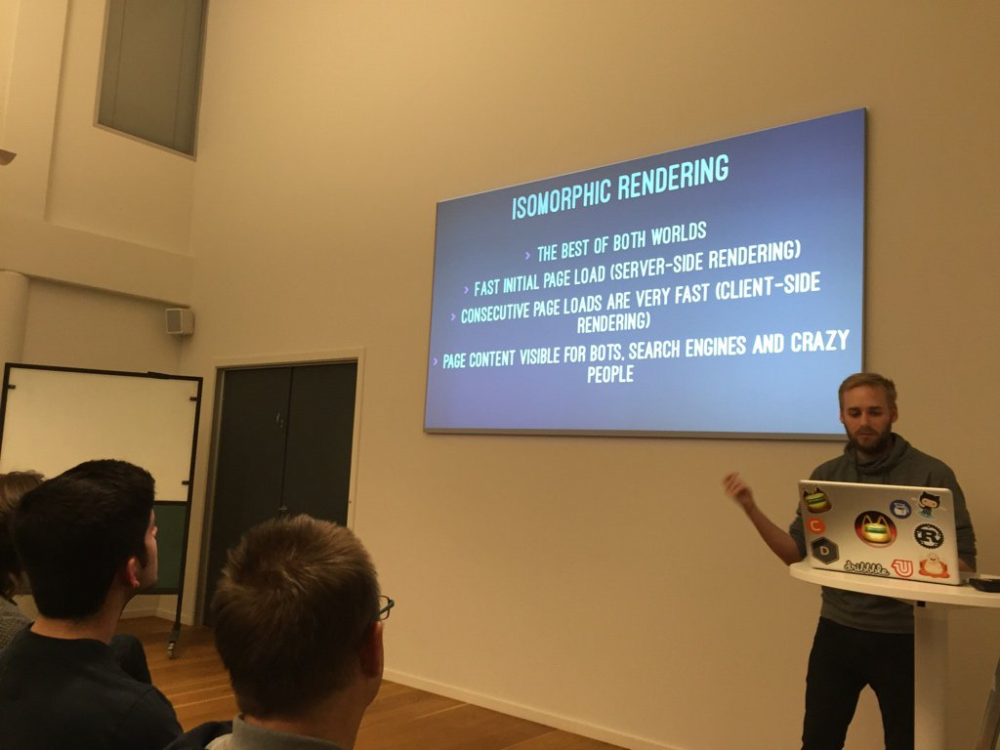

theme: Scherzkeks, 1

# Let's talk about Talks

---

# 👋
## @ksmandersen

^ Hi everyone!
^ My name is Kristian
^ This is my handle pretty much everywhere
^ Twitter, github, medium and so on

---

^ I work as an iOS and Full-stack developer at Northplay
^ We're a small entertainment studio here in Copenhagen

---

# Let's talk about Talks

^ Alright, let's get started
^ Let's talk about talks.
^ Very meta.

---

# I'm a bad Speaker

^ I get very nervous in big crowds
^ I really don’t like being the center of attention
^ When I give talks:
^ I have a hard time focusing,
^ I forget things that I want to say
^ I don’t speak loud enough for everyone to hear
^ I don't know where to look.
^ In general I am deeply uncomfortable.
^ My basic instict is blurp everything out as fast as possible and to flee the scene.

---

# Why give talks then?

^ So why do I then give talks?
^ It comes down to a couple of different things.

---

# Sharing is caring

^ I love sharing ideas and knowledge with other people
^ I get very excited about new technologies
^ I want other people to know about my discoveries
^ I could just write a blog post or an article but
^ Frankly I'm a pretty shitty writer too

---

# Learn something new

^ It’s a great way to learn something new
^ It could be a new language, a framework or a just an idea for something cool.
^ Pick a thing you want to learn
^ Commit to giving a talk about the subject
^ You'll have to Learn that thing really in-depth
^ To give a talk about a technology, you really have to have a deep understanding of it
^ You'll have to be able to answer questions you cant anticipate
^ You will know that subject better than anyone else

---

# Social booster

^ It gives other people an excuse to come talk to me after a talk.
^ That way I don't have to be the one to approach people in the same way.
^ And I get to meet a lot cool people.
^ Ask interesting questions or share their opinions

---

# Doing something that scares you

^ We have to face our fears to overcome them

---

# How do I become a better speaker?

^ How do I become a better speaker then?
^ How do I give better talks?

---

# 4 rules

^ Here's 4 basic rules I came up with

---

# 1. *Give more talks*

^ Rule #1 give more talks
^ It’s super intuitive. 
^ The more you do a thing, the better you get at it
^ The more I go up and present in front of a crowd, the less nervous I get each time
^ This also means not to get discouraged when doing a bad job. 
^ You’ll do better next time

---

# 2. *Script it*

^ Some people can improvise what to say at a talk
^ I am not one of those people
^ Putting your thoughs on what to say into text enables you to give better and more coherent talks
^ You can write an article as a stepping stone
^ Use the text/outline as presenters notes

--- 

# 3. *Rehearse it*

^ Give the talk to your self, your cat or your rubber duck multiple times
^ Once you have it down then give it to a co-worker or friend.
^ Just like giving more talks: The more you do it the better

---

# 4. *Just do it*

^ Go give your talk
^ Try to be confident. You did the work, now harvest the fruit of your labour.
^ Speak loudly
^ Don't stare into your laptop screen like I do

---

# 👋
## @ksmandersen

