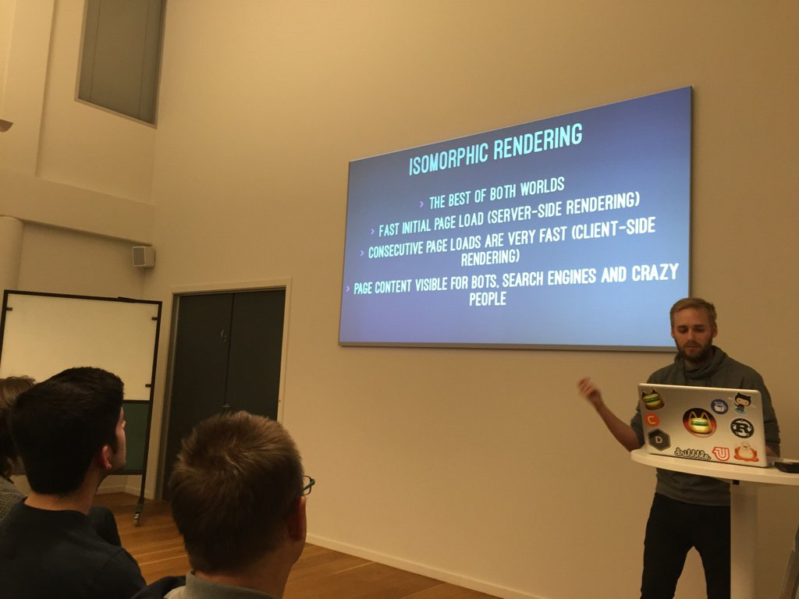
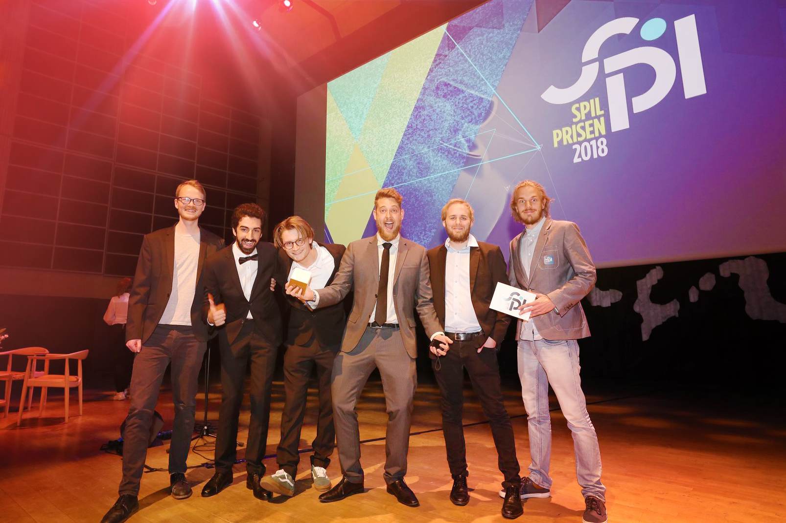
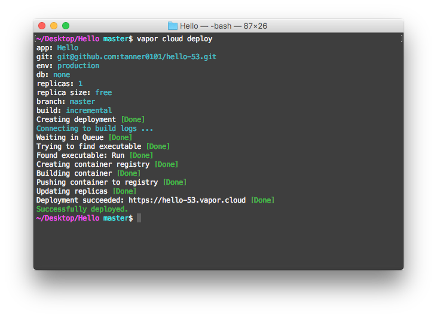
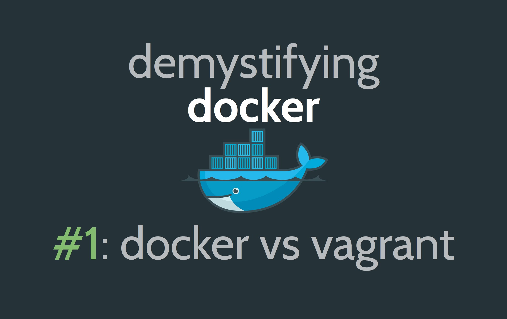
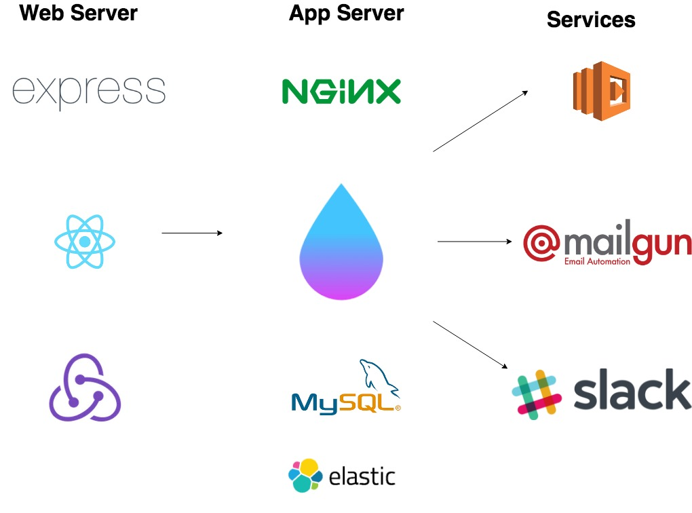

theme: Scherzkeks, 7

# Server-Side Swift
# In Production


---

# 👋
## @ksmandersen



^ Hi everyone!
^ My name is Kristian
^ This is my handle pretty much everywhere
^ Twitter, github, medium and so on

---


^ I work as an iOS and Full-stack developer at Northplay
^ We're a small entertainment studio here in Copenhagen

---



---


---

# Server-Side Swift
# In Production


---

# Is it ready?

---

# It depends

^ Scale of project
^ Services you provide

---

# Let's grade Vapor

- Performance **A+**

^ Vapor 3 ~95k RPS, 6MB memory footprint. 
^ Laravel: 1k 2GB, 
^ Node: 60k 256MB, 
^ Gin(Go): 99k, 18 MB

---

# Let's grade Vapor

- Performance **A+**
- Stability **A-**

^ 3 servers, 100% uptime 6+ months. Tools for reporting, measuring and loggin immature

---

# Let's grade Vapor

- Performance **A+**
- Stability **A-**
- Framework and language changes **C**

^ Swift still changes a lot and is not ABI stable. A pain when deploying to services
^ Vapor is still young and is already on its 3rd major version (since 2016).

---

# Let's grade Vapor

- Performance **A+**
- Stability **A-**
- Framework and language changes **C**
- Eco-system **E/F**

^ There is very few packages available for common things you'll need.
^ It is very hard to do basic stuff like resizing and transforming images

---

# Let's grade Vapor

- Performance **A+**
- Stability **A-**
- Framework and language changes **C**
- Eco-system **E/F**
- Community **A-**

^ The community support and help you get on places like Slack is stellar
^ You get quick answers
^ You even get to interact and influence the creators
^ Everyone can help out.
^ Often cant google it. Not mainstream on SO

---

# Security

---

# Headers

- Cross-site Scripting (XSS)
- SSL downgrade
- Content Injection
- Click-jacking

👉 brokenhandsio/VaporSecurityHeaders

---

# SSL

## **letsencrypt.org**

---

# SSL

## **letsencrypt.org**
- Remember Strict-Transport-Security (HSTS)
- Auto-renewal
- Wildcard certificates (introduced in march)

---

# Deployment


---

# Deployment

- Vapor Cloud
- Docker
- Heroku
- Dokku

---

# Vapor Cloud

---

# Vapor Cloud 

- Designed specifically for Vapor by the Vapor team
- Reasonable pricing with a free plan
- Well-documented
- Great CLI support

---

# Vapor Cloud

- Highly scalable
- Caching with Redis
- Zero-downtime deploys
- Monitoring & Metrics
- Easy S3 & CDN integration

---

# Vapor Cloud



---

# Docker

---

# Docker

- Runs everywhere
- Open Source
- Endlessly configurable
- Run on Linode for $5

---

# WTF is Docker?

---

# Containers


^ A kind of virtulization called Containers
^ Completely self-contained machine with its own OS
^ Runs only one program
^ Does not require same resources as a dedicated virtualized OS
^ Many containers can share the same physical resources (CPU/RAM)

---

# Images


^ Snapshots of file systems
^ Always based on another image
^ Incremental size
^ Cached. Makes rebuilding images super fast

---

# Dockerfile


^ A text file describing steps to build your image
^ Basically a recipe

---

# Dockerfile

```Dockerfile
FROM swift:4.1 as builder
RUN apt-get -qq update && apt-get -q -y install \
  your-dependencies-here # e.g. libmysqlclient-dev
WORKDIR /app
COPY . .
RUN mkdir -p /build/lib && cp -R /usr/lib/swift/linux/*.so /build/lib
RUN swift build -c release && mv `swift build -c release --show-bin-path` /build/bin

FROM ubuntu:16.04
RUN apt-get -qq update && apt-get install -y \
  libicu55 libxml2 libbsd0 libcurl3 libatomic1 \
  your-release-dependencies-here \ # e.g. libmysqlclient20
  && rm -r /var/lib/apt/lists/*
WORKDIR /app
COPY Resources/ ./Resources/
COPY Public/ ./Public/
COPY --from=builder /build/bin/myappbinary .
COPY --from=builder /build/lib/* /usr/lib/
EXPOSE 8080
CMD ["./myappbinary", "serve", "--env", "production", "--hostname", "0.0.0.0"]
```

[.footer: [bygri.github.io/2018/01/24/vapor-3-with-docker.html](https://bygri.github.io/2018/01/24/vapor-3-with-docker.html)]

---

# Demystifying Docker



[.footer: [youtube.com/watch?v=pGYAg7TMmp0](https://www.youtube.com/watch?v=pGYAg7TMmp0)]

---

# Dokku

---

# Dokku

- Runs almost anywhere
- Open Source
- Uses docker for infrastructure
- Deploy with git

---

# Dokku

- Any Database you want: mysql / postgres / sqlite
- Automated Lets Encrypt enrollment and renewal
- Many community plugins

^ Plugins: Slack notifcations, Elastic search, Redis

---

# Our stack



---

# Dokku

- Create a new Ubuntu16.04 server (DigitialOcean or Linode)
- SSH in and run:

```bash
wget https://raw.githubusercontent.com/dokku/dokku/v0.12.4/bootstrap.sh
sudo DOKKU_TAG=v0.12.4 bash bootstrap.sh
dokku apps:create hello-vapor-3
dokku domains:add hello-vapor-3 your-domain
dokku plugin:install https://github.com/dokku/dokku-mysql.git mysql
dokku mysql:create hello-vapor-db
dokku mysql:link hello-vapor-db hello-vapor-3
```

# Dokku

```bash
vapor new hello-vapor-3 --branch=beta --template=api
git remote add production dokku@your-domain
g push production master
```

---

# 👋
## @ksmandersen